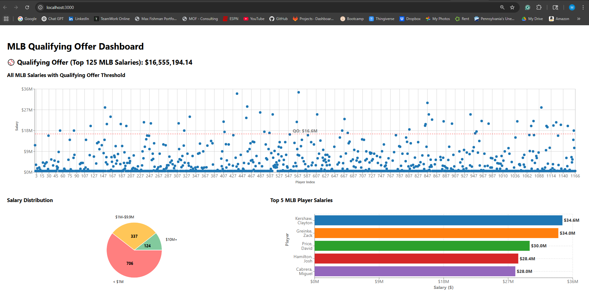

# Phillies Qualifying Offer Dashboard

This project is a data-driven dashboard that calculates the **MLB Qualifying Offer** based on the top 125 salaries from a dynamic dataset and presents meaningful salary insights via interactive visualizations.

It was developed in response to a software engineering prompt by the Phillies organization. The goal was not only to calculate the qualifying offer accurately, but also to present it with clarity, interactivity, and thoughtful design through the form of a frontend application.

---

## Dashboard Preview



---

## What is the Qualifying Offer?

In Major League Baseball, a team may offer a departing free agent a **one-year contract** called the **Qualifying Offer (QO)**. This is calculated as the **average salary of the top 125 highest-paid players** from the past season.

---

## Technologies Used

### Backend:

- **Python 3.10+**
- **Flask** – For serving a lightweight REST API
- **Pandas / BeautifulSoup** – For scraping and cleaning salary data
- **Logging** – Structured server-side logs for clarity

### Frontend:

- **React (Create React App)**
- **Recharts** – Interactive charting for:
  - Scatter plots
  - Pie charts
  - Bar charts
- **Fetch API** – Pulls live backend data every time the dashboard loads

---

## Project Structure

<pre>
phillies-qualifying-offer-app/
├── backend/
│ ├── server.py # Flask API entry point
│ ├── data_utils.py # Scraping and salary cleaning
│ ├── logic.py # Qualifying offer computation
│ └── requirements.txt # Python dependencies
│
├── frontend/
│ ├── public/
│ │ └── index.html
│ ├── src/
│ │ ├── App.js # React root component
│ │ └── components/
│ │ ├── QualifyingOffer.js
│ │ ├── ScatterPlot.js
│ │ ├── BarChart.js
│ │ └── PieChart.js
│ └── package.json # Frontend dependencies
│
└── README.md # You're reading it!
</pre>

---

## How to Run This Project

> **Pre-requisite**: Python 3.10+ and Node.js/NPM installed

### 1. Download or Clone the Project

You can either:

**Option A – Clone from GitHub:**

```bash
git clone https://github.com/TechMax14/phillies-qualifying-offer-app.git
cd phillies-qualifying-offer-app
```

**Option B – Download ZIP:**

1. Download and unzip the project folder
2. Navigate into the unzipped director:

```bash
cd phillies-salary-dashboard
```

### 2. Install and run the backend

```bash
cd backend
pip install -r requirements.txt
python server.py
```

➡️ The Flask API will start at:
http://localhost:5000/api/data

### 3. Install and run the frontend

Open a new terminal:

```bash
cd frontend
npm install
npm start
```

➡️ The React dashboard will open at:
http://localhost:3000

---

## Features

- Accurate Qualifying Offer calculation from live data

- Scatter Plot of all MLB salaries with threshold line

- Top 5 Salaries in a horizontal bar chart

- Salary Buckets breakdown via pie chart

- Live Refreshing from backend to reflect data changes

- Graceful handling of missing or malformed salary data

---

## Author Notes

- Each backend request triggers a fresh fetch from the MLB data source, ensuring accuracy.

- Code has been modularized for readability and future scalability.

- The solution emphasizes clarity, interaction, and real-time analysis in a frontend-friendly format.

---

### Acknowledgments

This project was developed with help from online documentation, open-source libraries, and occasional support from tools like ChatGPT to assist with debugging, code structure, and best practices.

---

## License

This project was created as part of a technical assessment and is not intended for commercial distribution.
